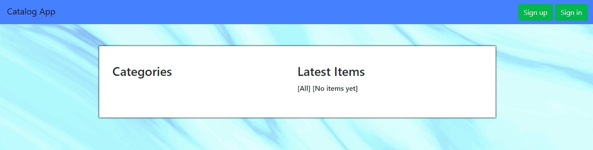

#Full Stack Nanodegree Project 2 Catalog App

##Running the App
**Note:** This app was written in Python3, so be sure to use Python3 when you 
install the dependencies or run the application.

* Clone this GitHub repository
* (Optional) Create a virtual environment
* Install packages from `requirements.txt` using this command:
```
pip install -r requirements.txt
```
*  Using the command line, change directory into the root folder of the 
repo. Then run the application using the following command
```
python3 run.py
```
* Enter http://localhost:5000/ in your browser to visit the home page of the application.
Please be sure to use localhost instead of 127.0.0.1 as Google OAuth doesn't  work with the later.
* All test data in the database has been removed. 
You will have create a new user,  new categories and 
new items in order to test the app. To create a new user, 
simply click on the "Sign In" or "Sign Up" button at the top 
right corner of the page. You can create an account 
 using the form or sigh in using Google. For other actions, please refer to the 
"List of Routes" section below.

###List of Routes
**Note:** In the following urls, "##" indicates an integer to be embedded in the url
that is used to identify a particular resource.

####1. http://localhost:5000/ or http://localhost:5000/catalog/all
Returns the home page of the app. Depending on whether the user is logged in, 
appropriate buttons are shown. The items' list on the left includes all
items in all categories.




####2. http://localhost:5000/signup
Presents the user with a sign up form. The user can also opt 
to sign up via Google.


####3. http://localhost:5000/login
Presents the user with a sign in form. The user can also opt 
to sign in via Google.


####4. http://localhost:5000/catalog/##
Returns home page with catalog selected. Edit and Delete buttons are shown if user 
is logged in. The items list on the left includes items only in that category.


####5. http://localhost:5000/catalog_categories/add_category
Allows user to create new category. 
The user must be signed in to access this route.


####6. http://localhost:5000/catalog_categories/##/edit
Allows the user to edit an existing category.
The user must be signed in to access this route.
The user must have created the category in order to be able to edit it.


####7. http://localhost:5000/catalog_categories/##/delete
Allows the user to delete an existing category.
The user must be signed in to access this route.
The user must have created the category in order to be able to delete it.


####8. http://localhost:5000/catalog_items/add_item
Allows the user to add a new item to any category.
The user must be signed in to access this route.


####9. http://localhost:5000/catalog_items/##
Allows the user to see the details of an item. Edit and Delete buttons 
are shown if the user is logged in.


####10. http://localhost:5000/catalog_items/##/edit
Allows the user to edit an item.
The user must be signed in to access this route.
The user must have created the item in order to be 
able to edit it.


####11. http://localhost:5000/catalog_items/##/delete
Allows the user to delete an item.
The user must be signed in to access this route.
The user must have created the item in order to be 
able to delete it.


###JSON Endpoints
#### http://localhost:5000/catalog.json
Returns JSON representing the whole catalog, that is,
including all categories and all items currently in the database.

#### http://localhost:5000/category/##.json
Returns JSON representing the category indicated, along with 
all items belonging to that category.

#### http://localhost:5000/item/##.json
Returns JSON represeting the item indicated.


### Routes that redirect

#### http://localhost:5000/gconnect
This route is used to authenticate the user via Google OAuth.
Upon successful authentication, redirects to home page.

####http://localhost:5000/logout
This route is used to Logout the user. It redirects to the homepage.
